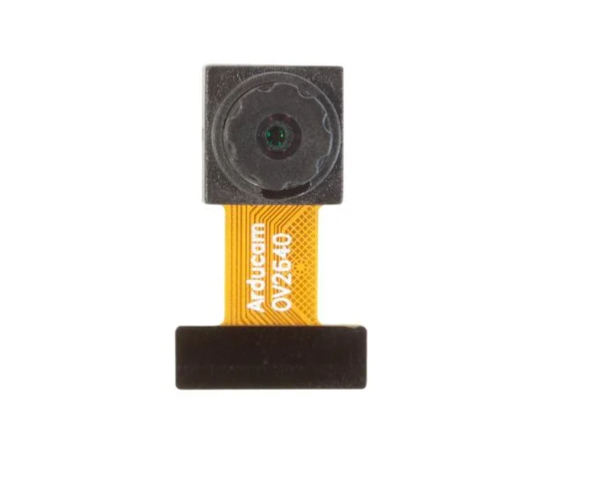
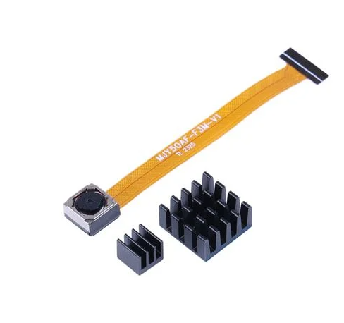
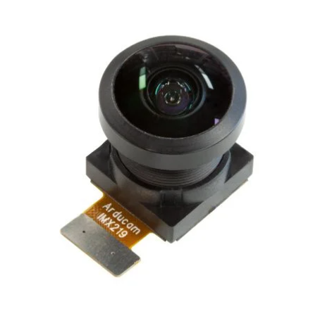
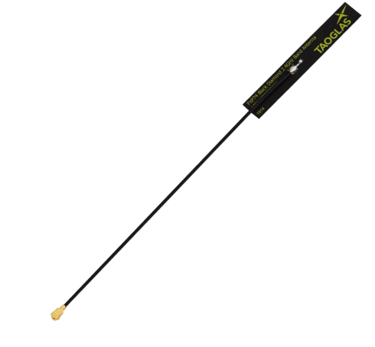
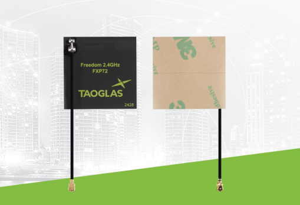
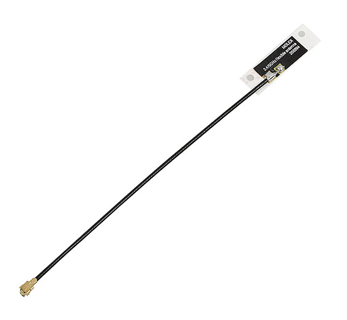

## Module's Selected Major Components

The following sections detail the selected major components of my camera sensor subsystem. These work in unison in order to fullfill the project requirements for this subsystem.

### Power Management (Pending further research)

>WIP

### Camera Sensor Subsystem Components

**Camera Modules**

1. OV2640 2MP Camera

   

    * $7/each
    * [link to product](https://www.arducam.com/arducam-ov2640-camera-module-2mp-mini-ccm-compact-camera-modules-compatible-with-arduino_m0031esp32-esp8266-development-board-with-dvp-24-pin-interface_.html?utm_source=chatgpt.com) 

    | Pros                                      | Cons                                                             |
    | ----------------------------------------- | ---------------------------------------------------------------- |
    | Has redily available support and ESP32 libraries      | Lowest resolution of the threee options              |
    | Easy to find from reputable vendors                   | Challenging to find separate from esp32 dev kits     |
    | Very affordable                                       | Fish eye distortion to image                         |
    | Lower resolution means lower bandwith requirements 1600x1200   |                                             |
    | Available as a standalone module                      |

2. OV5640 5MP Camera

    

    * $12/each
    * [link to product](https://www.digikey.com/en/products/detail/seeed-technology-co-ltd/114993115/21277047?gclsrc=aw.ds&gad_source=4&gad_campaignid=20243136172&gbraid=0AAAAADrbLliIj7nqkCgKgPAf35VmcjbPB&gclid=Cj0KCQiA18DMBhDeARIsABtYwT2GgNp2cgT6oq6x8lDDpRaIGovvy30oN0l5Lt_dI2OKIPChIDufihIaAn56EALw_wcB)

    | Pros                                      | Cons                                                             |
    | ----------------------------------------- | ---------------------------------------------------------------- |
    | Has redily available support and ESP32 libraries      | Slighly higher bandwith requirements                             |
    | Easy to find from reputable vendors                   | More difficult to configure than OV2640                          |
    | More expensive                                        | More expensive                                                   |
    | Higher resolution lens 2592x1944                      | 

3. IMX219 8MP Camera

    

    * $16/each + Pi
    * [link to product](https://www.arducam.com/arducam-imx219-wide-angle-camera-module-drop-in-replacement-for-raspberry-pi-v2-and-nvidia-jetson-camera-b0286.html)

    | Pros                                      | Cons                                                             |
    | ----------------------------------------- | ---------------------------------------------------------------- |
    | Larger size                                           | Requires Raspberry Pi as a bridge between camera and ESP32       |
    | Interchangeable lenses                                | Most complex solution                                            |
    | Readily Available                                     | Most expensive                                                   |
    | Highest resolution lens 3280x2464                     | May cause image distortion due to wide angle lens

**Rationale:** As a rover camera image quality is important, though lowering bandwith requirements would be more desired. Option 1 would be the choice to go with for this reason since it is also more simpler to configure due to many existing projects already using this camera. However, option 2 is a solid choice as an alternative since both the OV2640 and the OV5640 use the same connectors, the same pin out, and power requirements.

**Antenna**

1. FXP74 4dBi Antenna

    

    * $4.02/each
    * [link to product](https://www.digikey.com/en/products/detail/taoglas-limited/FXP74-07-0100A/3877416?gclsrc=aw.ds&gad_source=1&gad_campaignid=120565755&gbraid=0AAAAADrbLlgZA-wfFkVjL0-pdZ33x8ABV&gclid=Cj0KCQiA18DMBhDeARIsABtYwT08k87s1mwmgDJ7gRaUCMtLNKURm9b2yRdfqc_RSkHROIXoXmRWSU0aAqZBEALw_wcB)

    | Pros                                      | Cons                                                             |
    | ----------------------------------------- | ---------------------------------------------------------------- |
    | Works with 2.4 GHz Wi-Fi                  | 50% efficient, placement is important                            |
    | Good peak gain at 4 dBi                   | Single 2.4 GHz band                                              |
    | Compact                                   | Not directional                                                  |
    | Flexible placement                        |                                                                  |
    | Bluetooth compatible                      |

2. FXP72 3dBi Antenna

    

    * $3.62/each
    * [link to product](https://www.digikey.com/en/products/detail/taoglas-limited/FXP72-07-0053A/2332702?gclsrc=aw.ds&gad_source=1&gad_campaignid=120565755&gbraid=0AAAAADrbLlgZA-wfFkVjL0-pdZ33x8ABV&gclid=CjwKCAiA-sXMBhAOEiwAGGw6LAhgV2RVupQSf2ynJYEDeLKvd9Jyh3OxBOgERQCzDm_5qtmDbWKGuhoCGfYQAvD_BwE)

    | Pros                                      | Cons                                                             |
    | ----------------------------------------- | ---------------------------------------------------------------- |
    | Higher efficiency 67%                     | Physically larger                                                |
    | Bigger antenna may be less affected by placement if away from metal | Lower peak gain at 3 3.06 dBi          |
    | Readily Available at approved vendors                               | More expensive                         |
    | Very easy to adapt with FXP74                                       |                                        |
    | Bluetooth compatible                                                |

3. Molex 2069940100 3.6dBi Antenna

    

    * $1.95/each 
    * [link to product](https://www.digikey.com/en/products/detail/molex/2069940100/9450924)

    | Pros                                      | Cons                                                             |
    | ----------------------------------------- | ---------------------------------------------------------------- |
    | Low cost                                              | Installation placemeent sensitive                     |
    | Good peak gain of 3.6 dBi                             | Medium size                                           |
    | Dual band compatible 2.4 & 5 GHz                      | Very low efficiency due to design type                |
    | Bluetooth compatible                                  | 

**Justification**  
The usable wireless range of the camera subsystem is determined by the system link budget, which includes transmitter power, antenna gain, propagation loss, receiver sensitivity, and system losses. While the ESP32-S3 provides a fixed Wi-Fi transmit power, the use of an external antenna improves effective range by increasing antenna efficiency and allowing optimal placement away from noise sources. Environmental factors such as distance, obstructions, and multipath fading, significantly affect range at 2.4 GHz. Operating the camera in a low-resolution streaming mode reduces required data rate and improves receiver sensitivity, further extending usable range. This design approach supports a reliable near 30 m operating distance while remaining compliant with regulatory limits.

**Rationale:**
Ideally if size is not a problem all 3 options would work, they all share the same U.FL cable connector, and have around the same gain. Any should be good alterntives in case availability becomes a problem. For cost option 3 would be the best, but since we are trying to pass through video content (QVGA/ VGA) it would be best to go with options 1 or 2. At this point it becomes a matter of which one works with our available space in the rover, so option one would be the safer choice if space is a concern.

**Resources Used**  
More on antenna types and applications [here](https://www.digikey.com/en/articles/selecting-antennas-for-embedded-designs)