## Module's Selected Major Components

The following sections detail the selected major components of my camera sensor subsystem. These work in unison in order to fullfill the project requirements for this subsystem.

### Power Management (Pending further research)

>### Power Management

The subsystem requires multiple voltage levels to support different components:

9 V Input: Provided by an external AC-DC power supply
3.3 V Rail: Generated using a switching regulator to efficiently power the ESP32-S3
2.8 V Rail: Required for the OV2640 analog and I/O domains
1.5 V Rail: Required for the OV2640 digital core

Linear regulators were selected for the 2.8 V and 1.5 V rails to provide low-noise, stable voltage outputs necessary for proper camera operation. A switching 3.3 V regulator was chosen to power the ESP32 and its other sub components on the PCB.  Selecting the right components is critical for maintaining image quality, preventing signal instability, and for having a healthy power source for all components.

**2.8 V DC Regulator**

1. TPS7A0328DBVR

   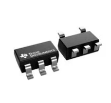

    * $0.51/each
    * [Link to product](https://www.digikey.com/en/products/detail/texas-instruments/TPS7A0328DBVR/13535484?gclsrc=aw.ds&gad_source=1&gad_campaignid=17922795960&gbraid=0AAAAADrbLlg_m6D50JmZCxSUdCpKXMyIp&gclid=CjwKCAjw5NvPBhAoEiwA_2egfhU9Pp_itG5N0F7aQUdLdyL4Kvv4QdF54ubLldK-ucYqqvTJs68yWRoCoBwQAvD_BwE)
    * [Datasheet](./tps7a03datasheet.pdf)
     

    | Pros                                      | Cons                                                             |
    | ----------------------------------------- | ---------------------------------------------------------------- |
    | Low noise      | Less efficient than switching regulator              |
    | Easy to find from reputable vendors                   | Limited to ~200 mA output current     |
    | Very affordable                                       | Not suitable for high power loads                        |
    | Simple design   |                                             |
    | Stable voltage                      |

2. TPS70628DBVT

    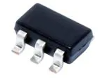

    * $1.54/each
    * [link to product](https://www.mouser.com/ProductDetail/Texas-Instruments/TPS70628DBVT?qs=jpHf3Ogds1xAn5jt6k4Sgw%3D%3D&srsltid=AfmBOookqmuDxmaTikgiI2YnVvLRYOBYGwQGrfS6vgpXb-erbN4R19ur)
    * [Datasheet](https://www.ti.com/lit/gpn/tps706)
    
    | Pros                                      | Cons                                                             |
    | ----------------------------------------- | ---------------------------------------------------------------- |
    | Higher current capability than needed      | Low Current Output ~150 mA                             |
    | Stable output                  | Bigger footprint
    | More expensive                                        | More expensive                                                   | 
    | Very low noise                      | 

3. MIC5225-2.8YM5 TR

    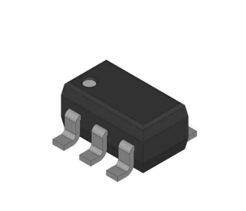

    * $~1/each
    * [link to product](https://www.lcsc.com/product-detail/C17550964.html)

    | Pros                                      | Cons                                                             |
    | ----------------------------------------- | ---------------------------------------------------------------- |
    | Small footprint                                          | Lower current capacity       |
    | Simple                               | Can be limiting under load spikes                                           |
    | Readily Available                                     | Hard to find expensive                                                   |
    | Affordable                     | Low stock

**Rationale:** The TPS7A0328DBVR is capable of supplying up to 200 mA, which is more than sufficient for the camera sensor’s requirements, while maintaining a compact footprint and simple implementation. Compared to the other regulators, the TPS7A03 offers a strong balance of noise performance, efficiency, and cost, making the best choice for this application. Additionally, the component is widely available and easy to integrate, supporting a reliable and practical design choice.

**3.3 VDC Regulator**

1. LM2575D2T-3.3R4G

   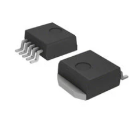

    * $2.23/each
    * [Link to product](https://www.digikey.com/en/products/detail/onsemi/LM2575D2T-3-3R4G/1476688)
    * [Datasheet](./LM2575-Ddatasheet.PDF)
     

    | Pros                                      | Cons                                                             |
    | ----------------------------------------- | ---------------------------------------------------------------- |
    | Can supply up to 1A     | Larger footprint             |
    | Wide input voltage range                   | Limited to ~200 mA output current     |
    | Built-in protections (thermal shutdown, current limiting)                                      | Requires external components                        |
    | Readily available in the classroom   |       Larger footprint                                      |
    | Stable voltage                      |

2. TPS62133RGTT

    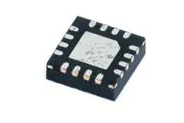

    * $2.74/each
    * [link to product](https://www.mouser.com/ProductDetail/Texas-Instruments/TPS62133RGTT?qs=gXEV9p%2FxLgcp%2Fye%252B%252BguV%2Fw%3D%3D)
     * [Datasheet](https://www.ti.com/lit/ds/symlink/tps62133.pdf?ts=1777831256000&ref_url=https%253A%252F%252Fwww.google.com%252F)
     

    | Pros                                      | Cons                                                             |
    | ----------------------------------------- | ---------------------------------------------------------------- |
    | Adjustable Voltage Output      | More complex                             |
    | 90-95% efficiency                 | Requires very small components                        |
    | More expensive                                        | More expensive                                                   |
    | Compact footprint                     |  Harder to solder

3. LM1117MPX-3.3/NOPB

    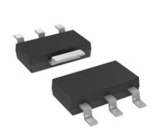

    * $1.07/each
    * [link to product](https://www.digikey.com/en/products/detail/texas-instruments/LM1117MPX-3-3-NOPB/366733?gclsrc=aw.ds&gad_source=1&gad_campaignid=9265913509&gbraid=0AAAAADrbLlj3xs4UbSWPRhxAYtzibYndB&gclid=CjwKCAjw5NvPBhAoEiwA_2egfm0ZlaBpSmxVt_E1jH8GEs2sea-4aiDx8YcTndOcUxcKCzDpoelX7BoCFQEQAvD_BwE)
    * [Datasheet](https://www.ti.com/lit/ds/symlink/lm1117.pdf?HQS=dis-dk-null-digikeymode-dsf-pf-null-wwe&ts=1721700739746)
     

    | Pros                                      | Cons                                                             |
    | ----------------------------------------- | ---------------------------------------------------------------- |
    | Very simple circuit                                          | Very inefficient      |
    | Low noise                                | Generates a significant amount of heat solution                                            |
    | Cheap and Readily Available                                     | Limited current margin                                                  |
    | Easy to solder                   | Not good for ESP32 under load

**Rationale:** The LM2575D2T-3.3R4G switching regulator was selected to generate the 3.3 V rail from the 9 V input due to its ability to efficiently step down higher voltages while supplying up to 1 A of current. This is sufficient to power the ESP32-S3 and associated peripherals during peak operation, including WiFi transmission. Additionally, this component is widely available, cost-effective, and well-documented, making it a practical choice for reliable implementation.

**1.5 V DC Regulator**

1. TLV70015DDCR

   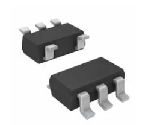

    * $0.24/each
    * [Link to product](https://www.digikey.com/en/products/detail/texas-instruments/TLV70015DDCR/2232565)
    * [Datasheet](./TLV70015DDCRdatasheet.pdf)
     

    | Pros                                      | Cons                                                             |
    | ----------------------------------------- | ---------------------------------------------------------------- |
    | Provides stable low-voltage      | Less efficient than switching regulator              |
    | Adequate current capacity (~200 mA)                   | Voltage drop results in power loss current     |
    | Very affordable                                       | Not suitable for high power loads                        |
    | Simple and compact design   |                                             |
    | Reliable for low-noise digital operation                      |

2. TPS7N5301RTER

    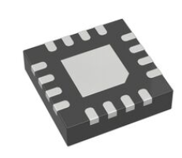

    * $3.59/each
    * [link to product](https://www.digikey.com/en/products/detail/seeed-technology-co-ltd/114993115/21277047?gclsrc=aw.ds&gad_source=4&gad_campaignid=20243136172&gbraid=0AAAAADrbLliIj7nqkCgKgPAf35VmcjbPB&gclid=Cj0KCQiA18DMBhDeARIsABtYwT2GgNp2cgT6oq6x8lDDpRaIGovvy30oN0l5Lt_dI2OKIPChIDufihIaAn56EALw_wcB)
    * [Datasheet](https://www.ti.com/lit/ds/symlink/tps7n53.pdf?ts=1738573031480&ref_url=https%253A%252F%252Fwww.ti.com%252Fproduct%252FTPS7N53%252Fpart-details%252FTPS7N5301RTER%253FkeyMatch%253DTPS7N5301RTER%2526tisearch%253Duniversal_search%2526usecase%253DOPN
      )
     

    | Pros                                      | Cons                                                             |
    | ----------------------------------------- | ---------------------------------------------------------------- |
    | Adjustable output      | Very expensive                             |
    | Up to 3A output current                   | More complex                          |
    | Low voltage drop                                     | More noise                                                   |
    |                      | 

3. IMX219 8MP Camera

    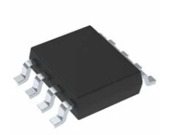

    * $3.48/each
    * [link to product](https://www.digikey.com/en/products/detail/texas-instruments/LP38842MR-ADJ-NOPB/755095)
    * [Datasheet](https://www.ti.com/general/docs/suppproductinfo.tsp?distId=10&gotoUrl=https%3A%2F%2Fwww.ti.com%2Flit%2Fgpn%2Flp38842-adj)
     

    
    | Pros                                      | Cons                                                             |
    | ----------------------------------------- | ---------------------------------------------------------------- |
    | Larger size                                           | Requires Raspberry Pi as a bridge between camera and ESP32       |
    | Interchangeable lenses                                | Most complex solution                                            |
    | Readily Available                                     | Most expensive                                                   |
    | Highest resolution lens 3280x2464                     | May cause image distortion due to wide angle lens

**Rationale:** The TLV70015 LDO regulator was selected to provide the 1.5 V rail for the OV2640 digital core (DVDD) due to its low-noise output, simplicity, cost, and adequate current capacity. The OV2640 digital core requires relatively low current (on the order of tens of milliamps), making the TLV70015’s 200 mA capability more than sufficient while maintaining a compact and efficient design.

(**remove this note/placeholder**: this is where your 3.3 volt switching regulator, any other needed power regulator, and power source {if applicable})

### Camera Sensor Subsystem Components

The selection of components for the camera subsystem was guided by requirements for real-time image capture, wireless communication, low power operation, and compatibility with a ESP32-S3 microcontrollers. Each component was chosen based on performance, integration capability, cost, and availability.

**Camera Modules**

1. OV2640 2MP Camera

   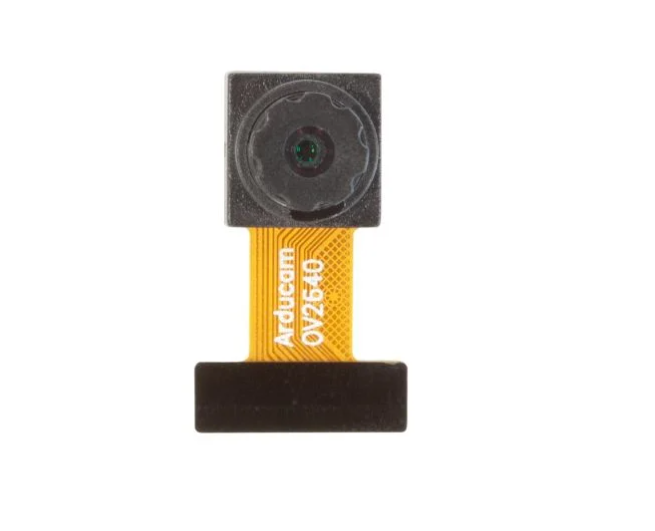

    * $7/each
    * [Link to product](https://www.arducam.com/arducam-ov2640-camera-module-2mp-mini-ccm-compact-camera-modules-compatible-with-arduino_m0031esp32-esp8266-development-board-with-dvp-24-pin-interface_.html?utm_source=chatgpt.com)
    * [Alternative listing](https://www.amazon.com/dp/B0CJTNMXXF?ref=ppx_yo2ov_dt_b_fed_asin_title)
    * [Datasheet](./03-Component-Selection/ov2640datasheet.pdf)
     

    | Pros                                      | Cons                                                             |
    | ----------------------------------------- | ---------------------------------------------------------------- |
    | Has redily available support and ESP32 libraries      | Lowest resolution of the threee options              |
    | Easy to find from reputable vendors                   | Challenging to find separate from esp32 dev kits     |
    | Very affordable                                       | Fish eye distortion to image                         |
    | Lower resolution means lower bandwith requirements 1600x1200   |                                             |
    | Available as a standalone module                      |

2. OV5640 5MP Camera

    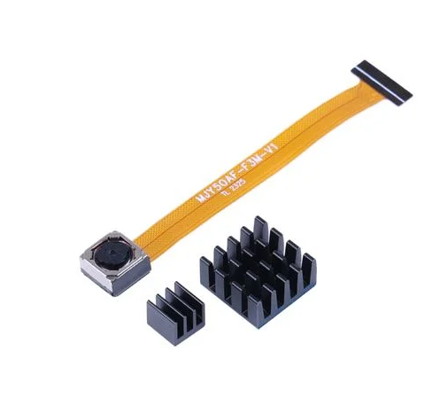

    * $12/each
    * [link to product](https://www.digikey.com/en/products/detail/seeed-technology-co-ltd/114993115/21277047?gclsrc=aw.ds&gad_source=4&gad_campaignid=20243136172&gbraid=0AAAAADrbLliIj7nqkCgKgPAf35VmcjbPB&gclid=Cj0KCQiA18DMBhDeARIsABtYwT2GgNp2cgT6oq6x8lDDpRaIGovvy30oN0l5Lt_dI2OKIPChIDufihIaAn56EALw_wcB)

    | Pros                                      | Cons                                                             |
    | ----------------------------------------- | ---------------------------------------------------------------- |
    | Has redily available support and ESP32 libraries      | Slighly higher bandwith requirements                             |
    | Easy to find from reputable vendors                   | More difficult to configure than OV2640                          |
    | More expensive                                        | More expensive                                                   |
    | Higher resolution lens 2592x1944                      | 

3. IMX219 8MP Camera

    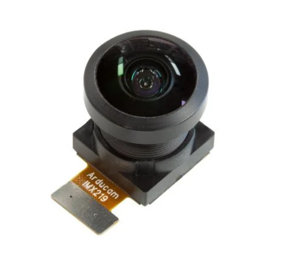

    * $16/each + Pi
    * [link to product](https://www.arducam.com/arducam-imx219-wide-angle-camera-module-drop-in-replacement-for-raspberry-pi-v2-and-nvidia-jetson-camera-b0286.html)

    | Pros                                      | Cons                                                             |
    | ----------------------------------------- | ---------------------------------------------------------------- |
    | Larger size                                           | Requires Raspberry Pi as a bridge between camera and ESP32       |
    | Interchangeable lenses                                | Most complex solution                                            |
    | Readily Available                                     | Most expensive                                                   |
    | Highest resolution lens 3280x2464                     | May cause image distortion due to wide angle lens

**Rationale:** As a rover camera image quality is important, though lowering bandwith requirements would be more desired. Option 1 would be the choice to go with for this reason since it is also more simpler to configure due to many existing projects already using this camera. However, option 2 is a solid choice as an alternative since both the OV2640 and the OV5640 use the same connectors, the same pin out, and power requirements.

**Resources**  

>If you need the zipped source files for the component selection or any other files for this project, please see the [Resources](https://mcastr11-collab/EGR314MannyDataSheet/Appendix/Resources) section.