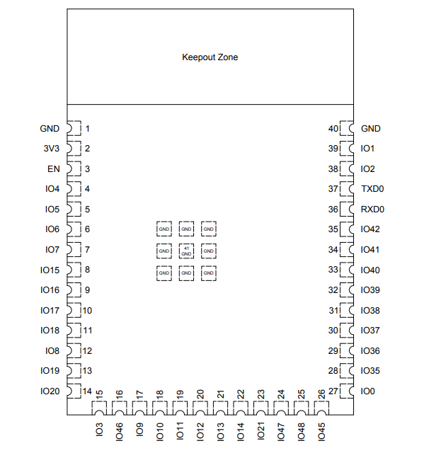

## Microcontroller Selection

ESP32 Information Table

| ESP32            | Information                                                       |
| --------------------------------------- | ---------------------------------------------------------------------------- |
| Model ESP32-S3-WROOM-1-N4         |                                                          |
|     Product Link          | [ESP32 Product Page](https://www.digikey.com/en/products/detail/espressif-systems/ESP32-S3-WROOM-1-N4/16162639)                                        |
|  Link to Datasheet    | [Datasheet](https://www.espressif.com/sites/default/files/documentation/esp32-s3-wroom-1_wroom-1u_datasheet_en.pdf) |
| Code examples | [ESP32-S3 Example Code Projects](https://randomnerdtutorials.com/getting-started-with-esp32/)                                          |
| Manufacturer Product Number                             | ESP32-S3-WROOM-1-N4                                       |
| Unit Cost                               | USD $5.21 at DigiKey price                                             |
| Supply Voltage Range                    | 3.0 V – 3.6 V                                                                |
| Wireless Communication                  | WiFi 802.11 b/g/n and Bluetooth 5                                            |
| Integrated Interfaces                   | UART, I2C/SCCB, SPI, PWM, USB, camera interface                              |
| Antenna                                 | PCB antenna                                                                  |
| Required Programming Hardware           | USB connection through USB Serial/JTAG or UART0 programmer                   |
| Reason Selected                         | Integrated WiFi, camera interface support, sufficient GPIO, and UART support |
 

The ESP32-S3 microcontroller was selected as the core of the subsystem due to its integrated WiFi capabilities, sufficient processing power, and extensive GPIO support. The ESP32 architecture provides dual-core processing and wireless communication, allowing it to handle image capture, processing, and web server hosting simultaneously.

Additionally, the ESP32 supports direct interfacing with camera modules through parallel data lines and control interfaces, eliminating the need for additional hardware. Its ability to host an HTTP server enables direct communication with a browser client, simplifying system design and improving usability.

>Below is a pin table of the ESP32-S3 I will be using.

  

  

>The following table contains the pins my components will be using on my ESP32-S3. 

| Module / Interface  | # Available on ESP32-S3 | Needed | Associated Pins in Camera Subsystem                      |
| ------------------- | ----------------------: | -----: | -------------------------------------------------------- |
| Camera DVP Data Bus |      1 camera interface |      1 | GPIO4, GPIO5, GPIO6, GPIO7, GPIO8, GPIO9, GPIO14, GPIO15 |
| Camera Sync / Clock |       GPIO capable pins |      4 | XCLK GPIO10, PCLK GPIO11, VSYNC GPIO12, HREF GPIO13      |
| SCCB / I2C Control  |       2 I2C controllers |      1 | SDA GPIO16, SCL GPIO17                                   |
| UART                |      3 UART controllers |      1 | TX GPIO39, RX GPIO40                                     |
| Camera Control GPIO |       GPIO capable pins |      2 | PWDN GPIO18, RESET GPIO21                                |
| LED Indicators      |       GPIO capable pins |      3 | Yellow GPIO48, Red GPIO42, Green GPIO47                  |
| USB Programming     | USB Serial/JTAG / UART0 |      1 | USB D− GPIO19, USB D+ GPIO20, or UART0 TX/RX             |
| WiFi                |              Integrated |      1 | Used for ESP32 access point and HTTP camera server       |

 

**Subsystem Description**  
The camera subsystem provides a live video feed to the drone operator, enabling improved situational awareness and navigation in complex or hazardous environments. This subsystem captures image data from the onboard camera and transmits it wirelessly to a browser-based interface, allowing the operator to monitor the drone’s surroundings in real time.

**Microcontroller Selection Rationale** 

The ESP32-S3-WROOM-1-N4 was selected because it provides the combination of wireless communication, camera interface support, and GPIO availability required for the camera subsystem. Its integrated WiFi capability allows the subsystem to host a local access point and HTTP server, enabling the operator to view the live camera feed through a standard web browser without requiring additional communication hardware.

The ESP32-S3 also supports the OV2640 camera sensor through a DVP (Digital Video Port) parallel interface for image data transfer and an SCCB (I²C-compatible) interface for configuration. In addition, the microcontroller provides sufficient GPIO resources to support the camera data bus, synchronization signals, reset and power-down control, UART communication, and LED status indicators.

UART communication was a critical requirement for integration with the team’s subsystem daisy-chain network. The ESP32-S3 supports reliable UART communication while simultaneously maintaining WiFi functionality. This enables the system to separate high-bandwidth image transmission over WiFi from low-bandwidth telemetry and control messages over UART, improving overall system efficiency.

Finally, the ESP32-S3-WROOM-1-N4 was readily available within the project environment and provided a flexible, easy to program, and well-documented platform. Since it met all subsystem requirements while simplifying integration and development, I selected it my choice of microcontroller.

**Resources**  

>If you need the zipped source files for the component selection or any other files for this project, please see the [Resources](https://mcastr11-collab/EGR314MannyDataSheet/Appendix/Resources) section.