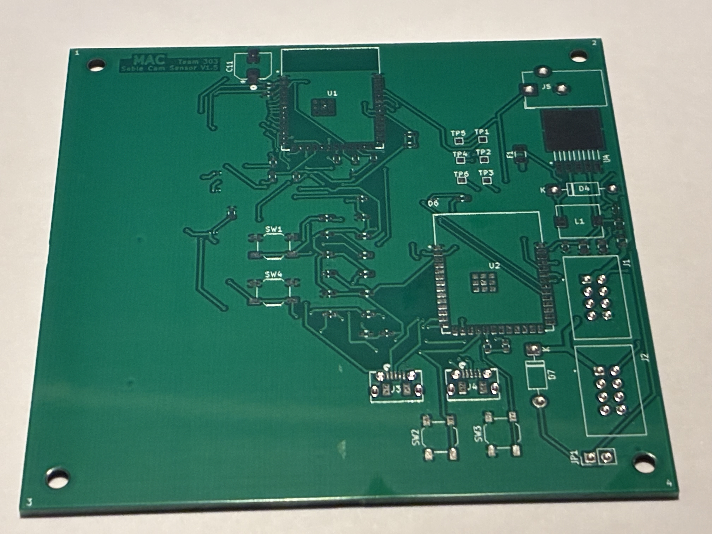
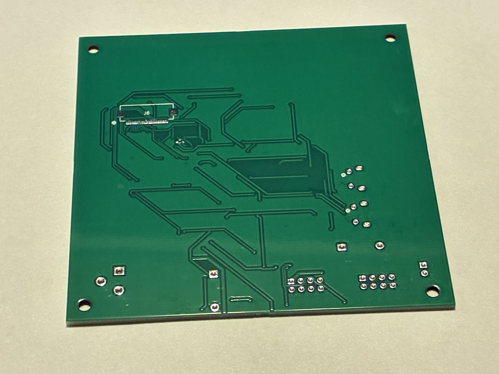
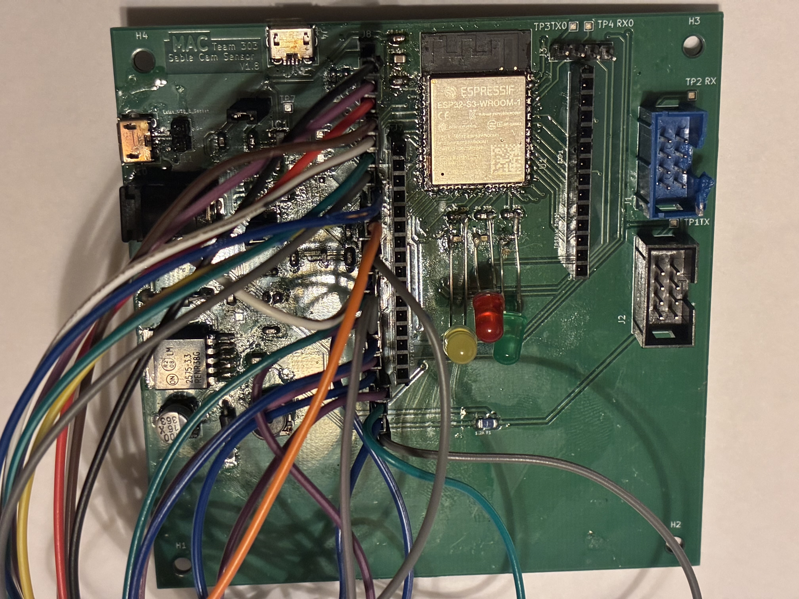
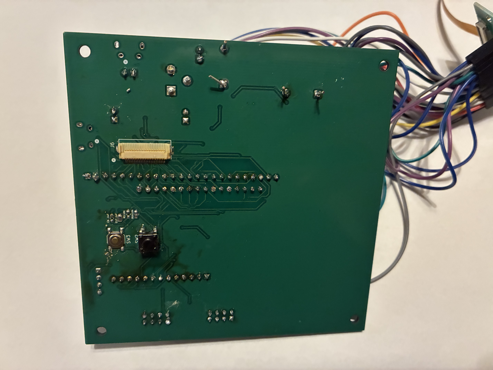
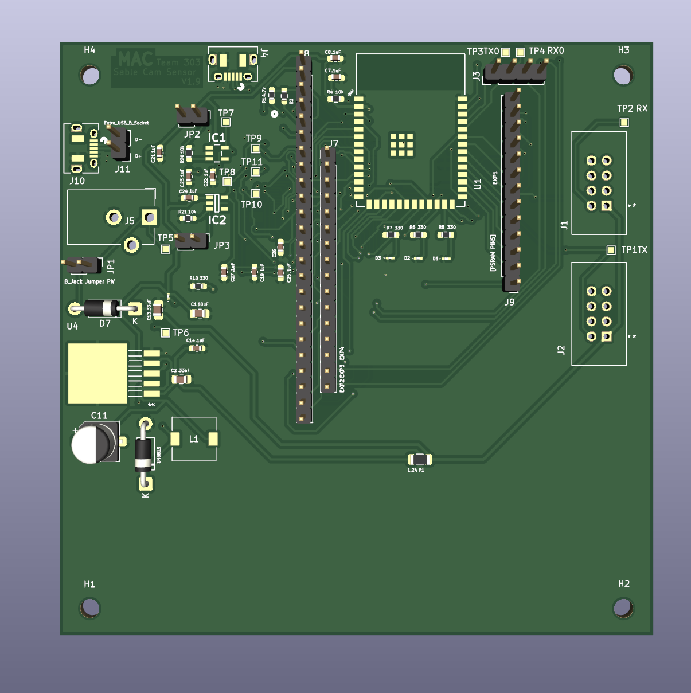
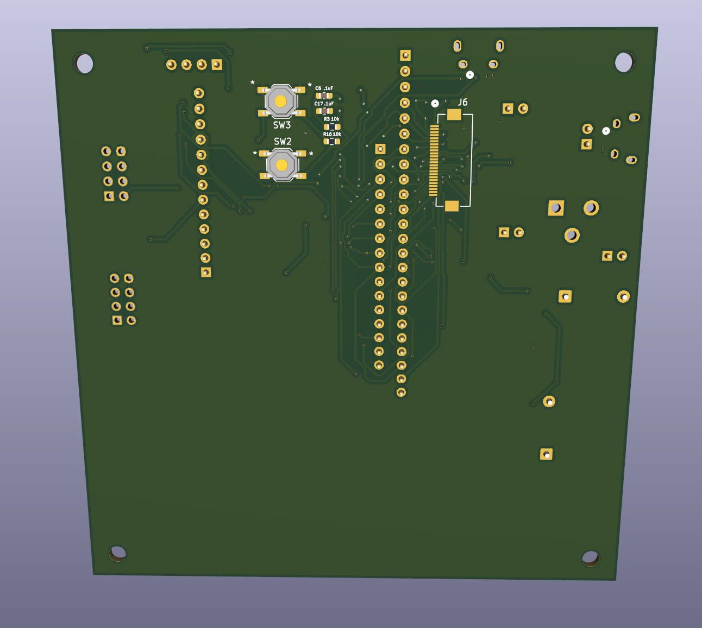

## Overview

The PCB for the camera subsystem was designed to integrate the ESP32-S3 microcontroller, OV2640 camera interface, power regulation circuitry, and communication interfaces into a compact and manufacturable layout. The design process began with schematic capture, followed by component placement and routing to ensure proper electrical performance and reliability. PCB design serves as the physical implementation of the circuit, connecting components through conductive traces and allowing signals and power to be distributed across the system.

  

Figure 1 - Top View of Bare PCB  

  

**Design Process**

The PCB design process followed a structured workflow:

* Schematic Capture:
All components, including the ESP32-S3, camera interface, regulators, and connectors, were first defined in the schematic to establish electrical connections.
* Component Placement:
Critical components were placed first, including the ESP32-S3 and camera connector. Placement was optimized to minimize trace length for high-speed camera signals and to improve overall layout efficiency.

* Trace Routing:
Traces were routed to connect all components while maintaining signal integrity and avoiding interference. Special attention was given to power and ground routing to ensure stable operation.
* Validation:
Design Rule Checks (DRC) and Electrical Rule Checks (ERC) were performed to ensure the PCB met manufacturing and electrical constraints before fabrication.

  

Figure 2 - Bottom View of Bare PCB  

### Key Considerations

Several important design decisions were made to ensure proper functionality and reliability. 

The PCB includes multiple voltage rails (3.3 V, 2.8 V, and 1.5 V). Wide traces and proper decoupling capacitors were used to ensure stable power delivery. Sensitive camera power rails (2.8 V and 1.5 V) were separated from the switching regulator to reduce noise.

The OV2640 camera uses a parallel DVP interface, which requires multiple data lines and synchronization signals. These signals were kept short and routed together to reduce timing mismatches and noise.

Lastly, a common ground plane was used across the PCB to provide a stable reference and reduce electrical noise. This is especially important for the camera sensor and high-speed signals. All components were grouped by funtciont in order to reduce interference with camera components and improve routing efficiency.

### Design Outcomes

  

Figure 3 - Top View of Assembled PCB  

 The final PCB design successfully integrates all required components into a compact and functional layout. The design supports reliable camera operation, stable power delivery, and communication with other subsystems through UART and WiFi. Additionally, the design is manufacturable using standard PCB fabrication processes and supports straightforward assembly.  

  

Figure 4 - Bottom View of Assembled PCB  

  
>Below you will find the PCB view on PDF with all layers turned on.

<object data="https://mcastr11-collab.github.io/EGR314MannyDataSheet/07-PCB/SablePCBalllayers.pdf" type="application/pdf" width="700px" height="700px">
    <embed src="https://egr304-203.github.io/sparkguard/Team203BlockDiagramFinal.pdf">
        
This browser does not support PDFs. Please download the PDF to view it: <a href="https://egr304-203.github.io/sparkguard/Team203BlockDiagramFinal.pdf">Download PDF</a>.

    </embed>
</object>  

### PCB 3D Renders

  

 Figure 5 - Front of Virtual PCB  

  

 Figure 6 - Rear of Virtual PCB  

## Resouces

The PCB as a PDF download is available [*here*](SableCamSensorv1.9schematic.pdf).

>If you need the zipped source files for the schematic or any other files for this project, please see the [Resources](Appendix/index.md) section.