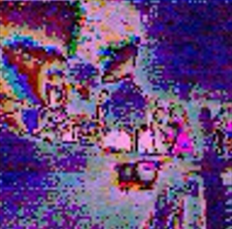
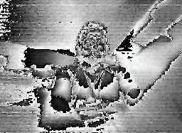
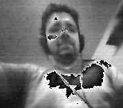

The camera subsystem successfully met the primary requirement of providing a live video feed to the drone operator. The ESP32-S3 microcontroller was able to interface with the OV2640 camera sensor and stream image data over WiFi using a self-hosted HTTP server on the ESP32-S3. This allowed the operator to view the camera feed through a web browser, fulfilling the requirement for wireless video transmission without the need for additional communication hardware. The subsystem also successfully integrated into the team’s UART daisy-chain network, allowing it to send telemetry data such as frame rate, resolution, and stream status to other subsystems.

In addition, the subsystem met power design requirements by implementing a multi-rail power system (3.3 V, 2.8 V, and 1.5 V) and validating it through a power budget. The PCB design successfully integrated the microcontroller, camera interface, power regulation, and communication interfaces into a single board.

However, some requirements were not fully achieved. The video quality and frame rate were limited due to the lack of PSRAM on the ESP32-S3 module, requiring the use of lower resolution grayscale images instead of full-color streaming. The frame rate achieved was approximately 2 FPS, which is functional but not ideal for real-time navigation. Additionally, the wireless range was limited by the onboard antenna and access point configuration. These limitations highlight areas for improvement in future iterations.

There was a learning curve in order to progress from my first image capture to something more usable down the line. The configuration and tuning of the OV2640 camera settings as I discovered was not as straightforward as I hoped. The camera did have auto exposure settings, but it took me a while to find the right thread that had good baseline configuration that I could start working from. 

The initial camera output appeared highly distorted and unusable due to incorrect default configuration settings and the memory limitations of the ESP32-S3 with no PSRAM.

<div align="center">
  
</div>
<div align="center"> Figure 1 - RGB Capture With Out-of-Box Settings<br><br>

As time went on I realized color was not going to be possible since not having PSRAM meant that colored images would have a three to five second delay between frames, which was not ideal.

<div align="center">
  
</div>
<div align="center"> Figure 2 - Grayscale Capture Without Configuring the Camera<br><br>

Switching over to gray scale introduced other challenges as now lighting over exposed the camera lens, and it was a battle to get the image to something more usable like what I was able to achieve below.

<div align="center">
  
</div>
<div align="center"> Figure 3 - Grayscale Capture With QVGA<br><br>

With this I was able to get the camera to a 320X240 resolution and a steady two frames per second. The framerate could improve if I reduced the image quality a bit from QVGA to QQVGA, which is 160X120 resolution.

With a [XIAO ESP32-S3 Sense](https://www.seeedstudio.com/XIAO-ESP32S3-Sense-p-5639.html?srsltid=AfmBOortHAxCDHRj2DqrsT-MoDrvqRXKZZhuzxsczGOoQUfZg3wF8nEA), I was able to do straight JPEG captures without the need of having software conversion as the middle man. The stream was also more usable at to over ten frames per second with QVGA. This is due to the onboard 8 MB of PSRAM that helps the ESP32 store more frames that are then sent over to the HTTP server. Below is a screenshot of the sensor in use.

<div align="center">
  
</div>
<div align="center"> Figure 4 - JPEG Capture With XIAO ESP32-S3 Sense<br><br>

**Known Working OV2640 Camera Configuration Settings**

<div align="Left"><br>
Below is a list of the camera settings I used to get the OV2640 to work at a steady FPS using a ESP32-S3 with no PSRAM. You can use these with your ESP32 that has PSRAM as your baseline, and you can start to increase the camera quality if you notice that performance is still fine.

<div align="Left"><br>

```cpp
  // No-PSRAM working setup
  config.xclk_freq_hz = 10000000;
  config.pixel_format = PIXFORMAT_GRAYSCALE;
  config.frame_size = FRAMESIZE_QVGA;   // 320x240
  config.fb_count = 1;
  config.fb_location = CAMERA_FB_IN_DRAM;
  config.grab_mode = CAMERA_GRAB_LATEST;

    s->set_brightness(s, 0); // -2 to 2
    s->set_contrast(s, -2); // -2 to 2
    s->set_saturation(s, -2); // -2 to 2
    s->set_special_effect(s, 0); // 0 to 6 (0 - No Effect, 1 - Negative, 2 - Grayscale, 3 - Red Tint, 4 - Green Tint, 5 - Blue Tint, 6 - Sepia)
    s->set_whitebal(s, 1); // 0 = disable , 1 = enable
    s->set_awb_gain(s, 1); // 0 = disable , 1 = enable
    s->set_wb_mode(s, 0); // 0 to 4 - if awb_gain enabled (0 - Auto, 1 - Sunny, 2 - Cloudy, 3 - Office, 4 - Home)
    s->set_exposure_ctrl(s, 1); // 0 = disable , 1 = enable
    s->set_aec2(s, 0); // 0 = disable , 1 = enable
    s->set_ae_level(s, 0); // -2 to 2
    s->set_gain_ctrl(s, 1); // 0 = disable , 1 = enable
    s->set_agc_gain(s, 0); // 0 to 30
    s->set_gainceiling(s, (gainceiling_t)0); // 0 to 6
    s->set_bpc(s, 1); // 0 = disable , 1 = enable
    s->set_wpc(s, 1); // 0 = disable , 1 = enable
    s->set_raw_gma(s, 0); // 0 = disable , 1 = enable (makes much lighter and noisy)
    s->set_lenc(s, 0); // 0 = disable , 1 = enable
    s->set_hmirror(s, 0); // 0 = disable , 1 = enable
    s->set_vflip(s, 0); // 0 = disable , 1 = enable
    s->set_dcw(s, 1); // 0 = disable , 1 = enable
    s->set_colorbar(s, 0); // 0 = disable , 1 = enable
```

### Microcontroller / Module Startup Tips<br>

* Always verify camera pin mapping carefully when working with the OV2640. Incorrect pin assignments can cause the camera to initialize but fail to capture frames.
* Start with the simplest working example, a basic camera test program, before adding features like streaming or telemetry.
* Use low resolutions (QQVGA or QVGA) during initial testing to avoid memory-related issues.
If image output looks distorted, adjust camera settings such as contrast, brightness, and exposure rather than assuming hardware failure.
* Enable debug serial output early to help identify initialization errors or frame capture failures.
* If you use a ESP32 with PSRAM, make sure PSRAM is properly configured or accounted for when selecting ESP32 modules, as it significantly affects image processing capability.
* Test UART communication separately before integrating it into the full system daisy chain or with just one other teammate.
* Use short, simple test messages when debugging UART forwarding and parsing logic.
* Verify power rails with a multimeter before connecting sensitive components like the camera sensor. This is critical when you get to the point of connecting the 8 pin connector for the UART daisy chain, especially if your team is sharing power!
* Keep wiring and PCB traces for camera signals short and clean to reduce noise and timing issues.

### Other Lessons Learned

This project provided me with valuable experience in both hardware and software design for embedded systems. One of the most important lessons learned was the importance of understanding hardware limitations early in the design process. The lack of PSRAM on the selected ESP32-S3 module significantly impacted the achievable frame rate and image quality, demonstrating how component selection directly affects system performance.

Another key lesson was the importance of incremental development. Attempting to build the full system at once led to confusion and debugging challenges. Breaking the project into smaller steps—such as camera initialization, image capture, streaming, and UART communication—made it easier to isolate and fix issues.

I also learned how critical power design is in embedded systems. Providing stable voltage rails for different parts of the system, especially sensitive components like the camera sensor, is essential for reliable operation. The use of both switching regulators and LDOs highlighted the trade-offs between efficiency and noise performance.

Additionally, I gained experience with PCB design, including component placement, routing, and manufacturability considerations. Designing a twice in a short amount of time made me a little more agile when it comes to PCB designing.

Another important lesson was the value of debugging tools and logging. Serial output was extremely useful in diagnosing issues with camera initialization, frame capture, and communication.

In closing, I learned the importance of system-level thinking. The camera subsystem was not an isolated component—it needed to communicate with other subsystems, meet power constraints, and integrate into the overall drone platform. Balancing these requirements required careful planning, adaptability, and coordination.
<br><br>

**My Recommendations for Future Students**<br>

If I could give a recommendation to future students, I would recommend that they start early and break their project into small, testable steps instead of trying to implement everything at once. This includes the PCB design part. It also as equally important to have a TA or the professor review your desing so your grade and your wallet does not suffer.

Carefully review your component selections, especially microcontrollers, to ensure they meet memory, performance, and interface requirements.

Spend time understanding power requirements and designing proper voltage regulation, as this is important for system stability.

Keep your design simple at first, and only add complexity once the basic system is working reliably.