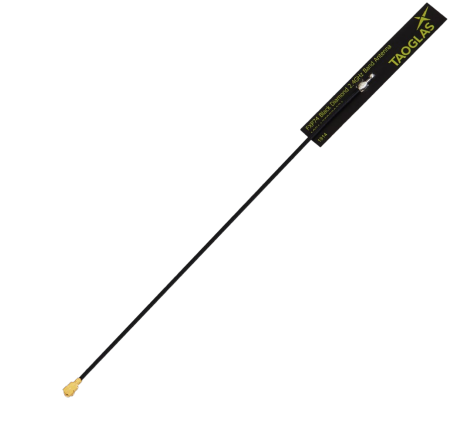
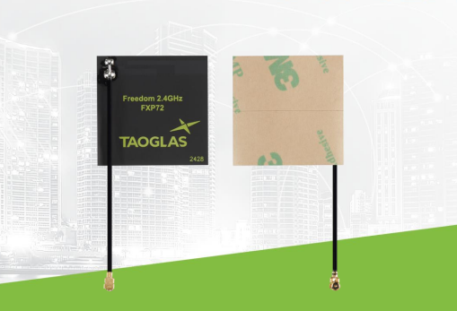
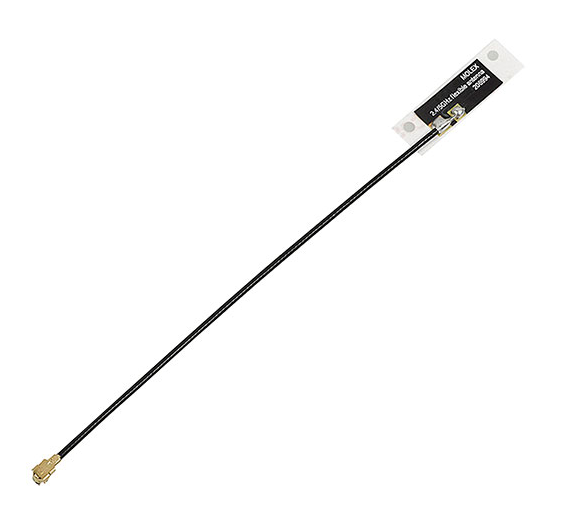

## Module's Major Components Selection Process

>**For each of the following sections, use <ins>one of the two styles</ins> given near the end. *REMOVE THIS NOTE***

### Power Management

(**remove this note/placeholder**: this is where your 3.3 volt switching regulator, any other needed power regulator, and power source {if applicable})

### Sensor

(**remove this note/placeholder**: if applicable, this is where your go through the sensor selection process, otherwise, remove this section.)

### Actuator

(**remove this note/placeholder**: if applicable, this is where your go through the motor selection process which includes both the driver and motor, otherwise, remove this section.)

-----------
> Remove the following before submitting!

### Style 1

> This is the example found in the assignment, uses more html

*Table 1: Example component selection*

**External Clock Module**

| **Solution**                                                                                                                                                                                    | **Pros**                                                                                                                                    | **Cons**                                                                                            |
| ------------------------------------------------------------------------------------------------------------------------------------------------------------------------------------------------- | ------------------------------------------------------------------------------------------------------------------------------------------- | --------------------------------------------------------------------------------------------------- |
|  Option 1.  XC1259TR-ND surface mount crystal $1/each [link to product](http://www.digikey.com/product-detail/en/ECS-40.3-S-5PX-TR/XC1259TR-ND/827366)                 | \* Inexpensive[^1] \* Compatible with PSoC \* Meets surface mount constraint of project                                               | \* Requires external components and support circuitry for interface \* Needs special PCB layout. |
|  \* Option 2.  \* CTX936TR-ND surface mount oscillator  \* $1/each  \* [Link to product](http://www.digikey.com/product-detail/en/636L3I001M84320/CTX936TR-ND/2292940) | \* Outputs a square wave  \* Stable over operating temperature   \* Direct interface with PSoC (no external circuitry required) range | * More expensive  \* Slow shipping speed                                                         |

**Choice:** Option 2: CTX936TR-ND surface mount oscillator

**Rationale:** A clock oscillator is easier to work with because it requires no external circuitry in order to interface with the PSoC. This is particularly important because we are not sure of the electrical characteristics of the PCB, which could affect the oscillation of a crystal. While the shipping speed is slow, according to the website if we order this week it will arrive within 3 weeks.

### Style 2

> Also acceptable, more markdown friendly

**External Clock Module**

1. XC1259TR-ND surface mount crystal

    

    * $1/each
    * [link to product](http://www.digikey.com/product-detail/en/ECS-40.3-S-5PX-TR/XC1259TR-ND/827366)

    | Pros                                      | Cons                                                             |
    | ----------------------------------------- | ---------------------------------------------------------------- |
    | Inexpensive                               | Requires external components and support circuitry for interface |
    | Compatible with PSoC                      | Needs special PCB layout.                                        |
    | Meets surface mount constraint of project |

1. CTX936TR-ND surface mount oscillator

    

    * $1/each
    * [Link to product](http://www.digikey.com/product-detail/en/636L3I001M84320/CTX936TR-ND/2292940)

    | Pros                                                              | Cons                |
    | ----------------------------------------------------------------- | ------------------- |
    | Outputs a square wave                                             | More expensive      |
    | Stable over operating temperature                                 | Slow shipping speed |
    | Direct interface with PSoC (no external circuitry required) range |

**Choice:** Option 2: CTX936TR-ND surface mount oscillator

**Rationale:** A clock oscillator is easier to work with because it requires no external circuitry in order to interface with the PSoC. This is particularly important because we are not sure of the electrical characteristics of the PCB, which could affect the oscillation of a crystal. While the shipping speed is slow, according to the website if we order this week it will arrive within 3 weeks.

**Antenna**

1. FXP74 4dBi Antenna

    

    * $4.02/each
    * [link to product](https://www.digikey.com/en/products/detail/taoglas-limited/FXP74-07-0100A/3877416?gclsrc=aw.ds&gad_source=1&gad_campaignid=120565755&gbraid=0AAAAADrbLlgZA-wfFkVjL0-pdZ33x8ABV&gclid=Cj0KCQiA18DMBhDeARIsABtYwT08k87s1mwmgDJ7gRaUCMtLNKURm9b2yRdfqc_RSkHROIXoXmRWSU0aAqZBEALw_wcB)

    | Pros                                      | Cons                                                             |
    | ----------------------------------------- | ---------------------------------------------------------------- |
    | Works with 2.4 GHz Wi-Fi                  | 50% efficient, placement is important                            |
    | Good peak gain at 4 dBi                   | Single 2.4 GHz band                                              |
    | Compact                                   | Not directional                                                  |
    | Flexible placement                        |                                                                  |
    | Bluetooth compatible                      |

2. FXP72 3dBi Antenna

    

    * $3.62/each
    * [link to product](https://www.digikey.com/en/products/detail/taoglas-limited/FXP72-07-0053A/2332702?gclsrc=aw.ds&gad_source=1&gad_campaignid=120565755&gbraid=0AAAAADrbLlgZA-wfFkVjL0-pdZ33x8ABV&gclid=CjwKCAiA-sXMBhAOEiwAGGw6LAhgV2RVupQSf2ynJYEDeLKvd9Jyh3OxBOgERQCzDm_5qtmDbWKGuhoCGfYQAvD_BwE)

    | Pros                                      | Cons                                                             |
    | ----------------------------------------- | ---------------------------------------------------------------- |
    | Higher efficiency 67%                     | Physically larger                                                |
    | Bigger antenna may be less affected by placement if away from metal | Lower peak gain at 3 3.06 dBi          |
    | Readily Available at approved vendors                               | More expensive                         |
    | Very easy to adapt with FXP74                                       |                                        |
    | Bluetooth compatible                                                |

3. Molex 2069940100 3.6dBi Antenna

    

    * $1.95/each 
    * [link to product](https://www.digikey.com/en/products/detail/molex/2069940100/9450924)

    | Pros                                      | Cons                                                             |
    | ----------------------------------------- | ---------------------------------------------------------------- |
    | Low cost                                              | Installation placemeent sensitive                     |
    | Good peak gain of 3.6 dBi                             | Medium size                                           |
    | Dual band compatible 2.4 & 5 GHz                      | Very low efficiency due to design type                |
    | Bluetooth compatible                                  | 

**Justification**  
The usable wireless range of the camera subsystem is determined by the system link budget, which includes transmitter power, antenna gain, propagation loss, receiver sensitivity, and system losses. While the ESP32-S3 provides a fixed Wi-Fi transmit power, the use of an external antenna improves effective range by increasing antenna efficiency and allowing optimal placement away from noise sources. Environmental factors such as distance, obstructions, and multipath fading, significantly affect range at 2.4 GHz. Operating the camera in a low-resolution streaming mode reduces required data rate and improves receiver sensitivity, further extending usable range. This design approach supports a reliable near 30 m operating distance while remaining compliant with regulatory limits.

**Rationale:**
Ideally if size is not a problem all 3 options would work, they all share the same U.FL cable connector, and have around the same gain. Any should be good alterntives in case availability becomes a problem. For cost option 3 would be the best, but since we are trying to pass through video content (QVGA/ VGA) it would be best to go with options 1 or 2. At this point it becomes a matter of which one works with our available space in the rover, so option one would be the safer choice if space is a concern.