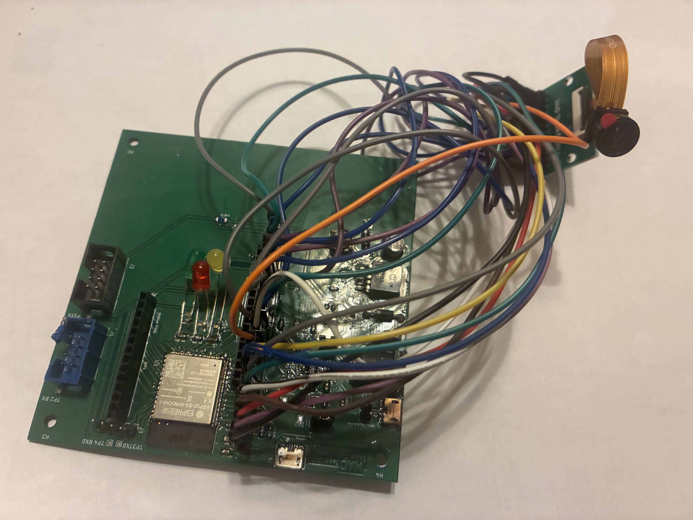
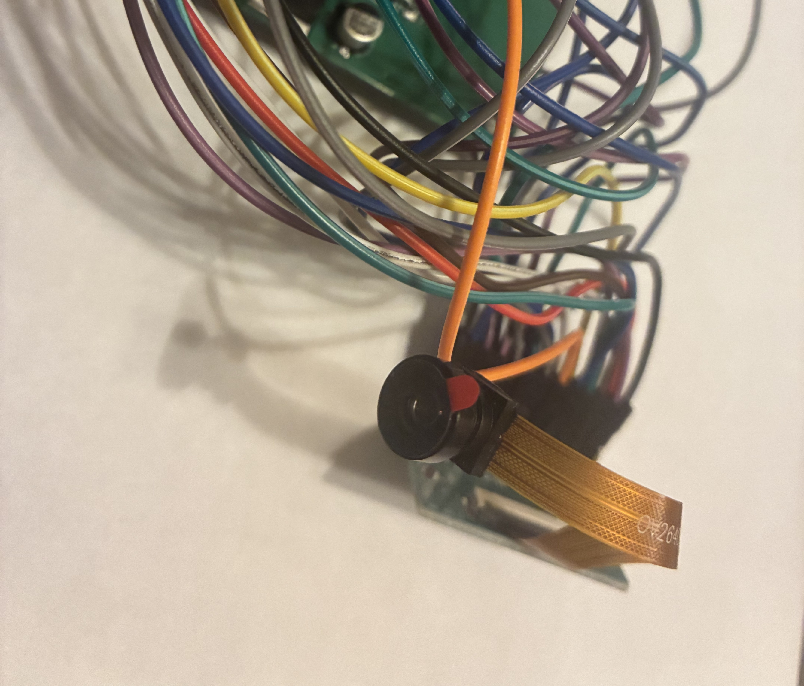

Manuel Castro's Datasheet 
as part of 
 Exploration Drone Project 
for 
 Team 303  

**Submission: 01, 18, 2026**

## Introduction

Hello, my name is Manny Castro and I am the leader of team 303. This project provided an opportunity to take concepts from previous robotics and embeded system courses and apply them towards the development of a working prototype on a custom printed circuit board.

The objective of this project was to design and implement an embedded subsystem incorporating sensors, actuators, and electric motors along with serial and wireless communication on a PCB. More specifically, each subsystem is to be a part of larger network that supports the control and operation of an exploration drone platform on the ground, air, or water environments.

### Project Summary

Our team developed Sable, a ground-based search and rescue drone designed to assist in locating people or retrieving small objects in difficult terrain or in environments that would otherwise be hazardous or dangerous for humans.

* If you wish to explore what my other teamates are doing for this project, please feel free to visit our [team report](https://egr314-s-2026-303.github.io/).

### My Contribution

  

My subsystem focuses on the camera system, which provides the drone operator with a live feed of the drone's surroundings. This helps the drone operator to be more effective at navigating around obstacles and helps identify objects or individuals within the vicinity of the drone.

I designed and integrated the camera sensor on a custom PCB, integrating my chosen ESP32-S3 microcontrollerwith the OV2640 image sensor from OmniVision. This included maping the camera interface pins on its 24 pin FPC connector, and providing regulated power to both the ESP32-S3 microcontroller and the OV2640. The camera sensor required a dedicated 1.5V and 2.8V power rail, while the ESP32-S3 operates a 3.3V power rail.

  

On the software side, I developed firmware to initialize the camera, capture image frames, and convert raw image data into JPEG format for efficient transmission. The system streams this data over WiFi using an embedded HTTP server hosted on the ESP32-S3.

In addition to the video streaming, I implemented a UART communication system to integrate my camera subsystem into the team's distributed network. This includes message formatting, parsing, forwarding, and broadcast handling for inter subsystem communication. The UART system also transmits telemetry data such as framerate, resolution, and camera stream status, to the Human-Machine Interface.

Finally, I created a website interface that the drone operator can use to view a live video feed of the drone camera and see performace metrics related to the camera such as, the size of the data, framerate, resolution, and total frames captured.

  

* The list of components used to construct my subsystem may be found in the ["BOM"](https://mcastr11-collab.github.io/EGR314MannyDataSheet/04-BOM/BOM/) section of the datasheet.

